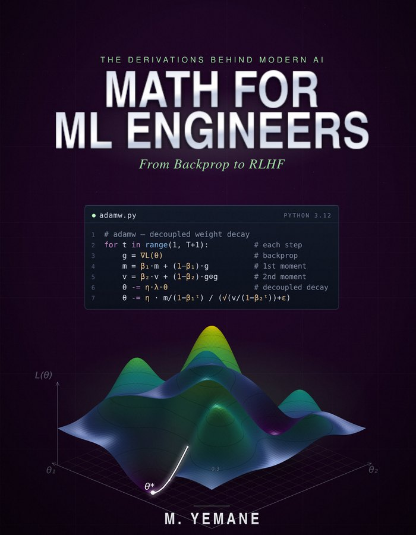

<p align="center">
  <a href="https://mikaelyemane.github.io/ml-math-code/"></a>
</p>

# Math for ML Engineers: Code & Challenges

The runnable companion to ***Math for ML Engineers: From Backprop to RLHF***. It holds:

- pure-NumPy mirrors of every chapter's derivations;
- the five flagship challenges;
- reference implementations of the modern-stack topics;
- sixteen Colab-ready chapter notebooks, plus fifteen for the launch articles.

📕 **The book:** 826 pages, 19 chapters in five parts, six appendices. [Book website](https://mikaelyemane.github.io/ml-math-code/).
- **PDF**, full color, searchable, no DRM: $39, [buy direct](https://mikaelyemane.lemonsqueezy.com/checkout/buy/f05af828-35b7-42c7-8567-8ab40858c469).
- **Paperback** (grayscale, 7×9 in) $59.99 and **Kindle** $39: coming soon on Amazon.

🆓 **Free sample:** [Chapter 5, *Gradient Descent and the Optimization Landscape* (PDF)](docs/sample_chapter5.pdf), in full, no email required.
🔓 **This repo is free and unpaywalled, always.**

> At step 47,213 of a pretraining run, the loss spiked 6×. The cause was a four-byte integer: an attention-scaling term reading the wrong config key. The derivation that would have caught it is three equations long. (The incident is a composite of several real ones.) The code here is where you watch that math run.

---

## Quick start

```bash
git clone https://github.com/mikaelyemane/ml-math-code.git
cd ml-math-code/code
python3 ch05_optimizers.py                    # SGD, momentum, Adam with bias correction
python3 ch11_attention.py                     # SDPA, causal mask, multi-head, KV-cache step
python3 reference/flash_attention_numpy.py    # FlashAttention forward, checked against vanilla
```

- **Checks:** every chapter file runs standalone. Where the chapter derives a gradient, the file prints a check against finite differences, and all of these sit well below the book's 10⁻⁵ target.
- **Style:** pure NumPy, no autograd, no black boxes.
- **Dependencies:** Python 3.9+ and `numpy` for everything in `code/`, with two exceptions:
  - `code/reference/nano_gpt.py` also needs `torch`;
  - `pytest` is optional for `code/ch18_testing.py`.

  The notebooks also use `matplotlib` (and `scipy` in Chapter 6).

```bash
pip install numpy          # + torch for nano_gpt.py, + matplotlib for the notebooks
```

---

## Layout

```
code/
  ch01..ch16_*.py           One runnable file per chapter (Parts I-IV)
  ch17_point_in_time.py     Part V: the chapter's as-of join, worked, with its contract test
  ch18_testing.py           Part V: unit, invariance and manifest tests (runs with or without pytest)
  ch19_drift_monitoring.py  Part V: PSI, the Jeffreys-divergence view, the empirical-null threshold
  challenges/               Hands-on problems + worked solutions
  reference/                Cleanest implementations of the flagship topics
notebooks/                  Sixteen Colab-ready notebooks, one per chapter for Chapters 1-16
  articles/                 One notebook per launch article; each reproduces the article's numbers and figure
docs/                       Book website (GitHub Pages) and the free Chapter 5 PDF
```

`code/README.md` lists every file and the results it reproduces.

## Flagship challenges

Each one pairs with a *Challenge* box in the book.

| | Challenge | Book | File |
|---|---|---|---|
| 🔍 | Find the bug | Ch 5, Adam | `code/challenges/ch05_find_the_bug.py` (+ `_solution.md`) |
| 🏗️ | Build nanoGPT in 250 lines | Ch 11, Transformer | `code/reference/nano_gpt.py` |
| 📜 | FlashAttention in pure NumPy | Ch 11, FlashAttention | `code/reference/flash_attention_numpy.py` |
| 🏛️ | KV-cache memory three ways | Ch 11, KV cache | `code/reference/kv_cache_archaeology.py` |
| 💸 | Plan a 1M-DAU LLM product on the back of an envelope | Ch 15, cost model | `code/challenges/ch15_plan_1m_dau.py` (+ `_solution.md`) |

Doing all five means you will have:

- debugged a real Adam bug;
- trained a language model;
- implemented FlashAttention from its recurrence;
- computed production memory math three independent ways;
- sized and priced an inference fleet from first principles.

## Notebooks

There are sixteen notebooks, one per chapter for Chapters 1–16. Each opens in Colab with one click, and each ties its code to the book's numbered equations or named results. See [`notebooks/README.md`](notebooks/README.md).

[`notebooks/articles/`](notebooks/articles/README.md) holds one notebook per article in the launch series. Each reruns the article's code and reproduces every number it quotes.

---

## Errata & contributing

Found a typo, a sign error, or a broken check? [Open an issue](https://github.com/mikaelyemane/ml-math-code/issues); confirmed errata are credited. PRs are welcome for code fixes, extra gradient checks, and notebook improvements.

## License

**MIT**: see [`LICENSE`](LICENSE). The code is free to use, modify, and redistribute.

The following are © 2026 Mikael Yemane, all rights reserved, and are not covered by the MIT license:
- the book text, figures, and cover art;
- the sample chapter PDF.

## Citation

```bibtex
@book{yemane2026mathml,
  title     = {Math for ML Engineers: From Backprop to RLHF},
  author    = {Yemane, Mikael},
  year      = {2026},
  isbn      = {979-8-9974520-0-1},
  note      = {Self-published}
}
```
